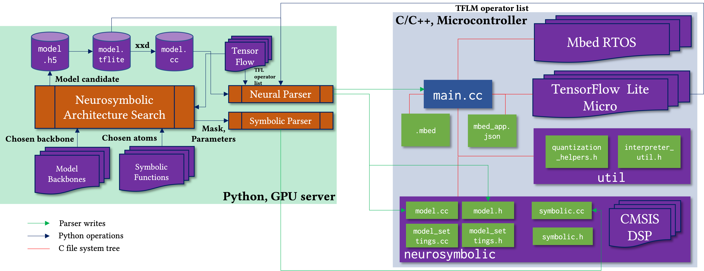

# Tiny-NS: Platform-Aware Neurosymbolic Auto Tiny Machine Learning

Example of TinyNS in action for Symbolic Neuro Symbolic paradigm:


## Paper
https://dl.acm.org/doi/10.1145/3603171

## Summary

Machine learning at the extreme edge has enabled a plethora of intelligent, time-critical, and remote applications. However, deploying interpretable artificial intelligence systems that can perform high-level symbolic reasoning and satisfy the underlying system rules and physics within the tight platform resource constraints is challenging. In this paper, we introduce TinyNS, the first platform-aware neurosymbolic architecture search framework for joint optimization of symbolic and neural operators. TinyNS provides recipes and parsers to automatically write microcontroller code for five types of neurosymbolic models, combining the context awareness and integrity of symbolic techniques with the robustness and performance of machine learning models. TinyNS uses a fast, gradient-free, black-box Bayesian optimizer over discontinuous, conditional, numeric, and categorical search spaces to find the best synergy of symbolic code and neural networks within the hardware resource budget. To guarantee deployability, TinyNS talks to the target hardware during the optimization process. We showcase the utility of TinyNS by deploying microcontroller-class neurosymbolic models through several case studies. In all use cases, TinyNS outperforms purely neural or purely symbolic approaches while guaranteeing execution on real hardware.

## Code Architecture
- ```MLPerf 0.5 Benchmarks```: Runs 3 of the 4 MLPerf Tiny v0.5 Inference Benchmarks, reference: https://github.com/mlcommons/tiny .
- ```Joint Feature and Model Opt```: Contains code for neurosymbolic optimization of features and neural weights.
- ```Human Activity Recognition```: Contains link to repository for earable fall detection under 2 kB and activity recognition (https://github.com/nesl/auritus).
- ```NAS Detection and Tracking```: Contains code for optimization of neural detector weights and symbolic object tracker based on ByteTrack library, reference: https://github.com/ifzhang/ByteTrack and https://github.com/xingyizhou/CenterTrack 
- ```Adversarially Robust NAS```: Contains code for improving adversarial robustness of TinyML models.
- ```Neural Inertial Localization```: Contains link to repository for physics-aware neural inertial localization (https://github.com/nesl/tinyodom).
- ```Neural Kalman Sensor Fusion```: Contains link to repository for neural-Kalman sensor fusion (https://github.com/nesl/agrobot).


## Required items

- A GPU Workstation running Ubuntu 20.04.
- Python 3.8+ must be installed, preferably through Anaconda or Virtualenv, https://docs.conda.io/en/latest/, https://virtualenv.pypa.io/en/latest/
- Python package requirements for the virtual environment we used are listed in requirements.txt. Please install them before running the Python scripts. Note that Tensorflow 2.5.0 is a must. Tensorflow 1.x would not work.
- Couple of STM32 Nucleo Boards (must be Mbed enabled) for platform-in-the-loop NAS, https://www.st.com/en/evaluation-tools/stm32-nucleo-boards.html, https://os.mbed.com/platforms/
- GNU ARM Embedded Toolchain (for Mbed CLI), https://developer.arm.com/tools-and-software/open-source-software/developer-tools/gnu-toolchain/gnu-rm
- C/C++ compiler for Mbed CLI and conversion of TinyML models to C (your computer will generally come with one).

## Citation

Swapnil Sayan Saha, Sandeep Singh Sandha, Mohit Aggarwal, Brian Wang, Liying Han, Julian de Gortari Briseno, and Mani Srivastava, "TinyNS: Platform-Aware Neurosymbolic Auto Tiny Machine Learning", in ACM Transactions on Embedded Computing Systems, 2023.

## Acknowledgements

The research reported in this paper was sponsored in part by the Air Force Office of Scientific Research (AFOSR) under Cooperative Agreement FA9550-22-1-0193; the IoBT REIGN Collaborative Research Alliance funded by the Army Research Laboratory (ARL) under Cooperative Agreement W911NF-17-2-0196; 
the NIH mHealth Center for Discovery, Optimization and Translation of Temporally-Precise Interventions (mDOT) under award 1P41EB028242; 
the National Science Foundation (NSF) under awards # 1705135 and 1822935; and, the CONIX Research Center, one of six centers in JUMP, a Semiconductor Research Corporation (SRC) program sponsored by DARPA. The views and conclusions contained in this document are those of the authors and should not be interpreted as representing the official policies, either expressed or implied, of the AFOSR, ARL, DARPA, NIH, NSF, SRC, or the U.S. Government. The U.S. Government is authorized to reproduce and distribute reprints for Government purposes notwithstanding any copyright notation here on.
